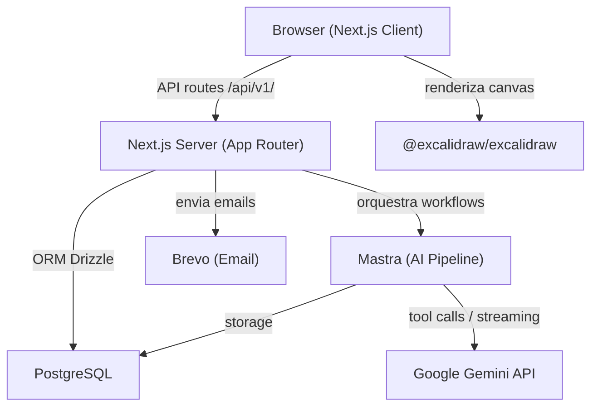

# Diagrama de Arquitetura

## Integrações

| Serviço | Papel | Config |
|---|---|---|
| PostgreSQL | Banco de dados principal | `DATABASE_URL` |
| Google Gemini | LLM para geração de outline e slides | `GOOGLE_GENERATIVE_AI_API_KEY` |
| Brevo | Email transacional (verificação, reset de senha) | `BREVO_API_KEY` |
| Excalidraw | Canvas de renderização no frontend | `@excalidraw/excalidraw` |

## Futuro

| Serviço | Papel |
|---|---|
| Stripe | Billing e planos |
| S3 / R2 | Storage de thumbnails e exports |
| Redis | Cache de sessões e rate limiting |
