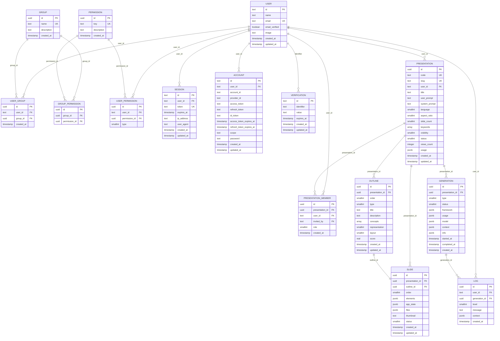

# Diagrama Lógico de Dados

---

## Enums

| Tabela | Campo | Valores |
|---|---|---|
| `user_permission` | `type` | `0` grant · `1` deny |
| `presentation` | `status` | `0` draft · `1` active · `2` inactive · `3` trash |
| `presentation` | `visibility` | `0` public · `1` private |
| `presentation` | `language` | `0` en · `1` es · `2` fr · `3` de · `4` it · `5` pt-BR · `6` ru · `7` zh · `8` ja · `9` ko |
| `presentation` | `aspect_ratio` | `0` 16:9 · `1` 4:3 · `2` 9:16 · `3` 1:1 · `4` A4 · `5` custom |
| `presentation_member` | `role` | `0` viewer · `1` editor |
| `outline` | `type` | `0` cover · `1` agenda · `2` content · `3` summary · `4` closing |
| `outline` | `representation` | `0` auto · `1` flowchart · `2` mindmap · `3` orgchart · `4` sequence · `5` class · `6` er · `7` gantt · `8` timeline · `9` tree · `10` network · `11` architecture · `12` dataflow · `13` state · `14` swimlane · `15` fishbone · `16` pyramid · `17` venn · `18` matrix · `19` funnel · `20` infographic |
| `outline` | `layout` | `0` auto · `1` title_only · `2` title_content · `3` two_column · `4` image_text · `5` full_image · `6` bullets · `7` blank |
| `slide` | `status` | `0` active · `1` inactive · `2` trash |
| `generation` | `type` | `0` outline · `1` slide |
| `generation` | `status` | `0` pending · `1` running · `2` completed · `3` failed |
| `log` | `level` | `0` debug · `1` info · `2` warn · `3` error |
