# Diagrama Lógico de Dados

```mermaid
erDiagram

    USER {
        text id PK
        text name
        text email UK
        boolean email_verified
        text image
        timestamp created_at
        timestamp updated_at
    }

    GROUP {
        uuid id PK
        text name UK
        text description
        text created_by FK
        timestamp created_at
    }

    USER_GROUP {
        uuid id PK
        text user_id FK
        uuid group_id FK
        text assigned_by FK
        timestamp created_at
    }

    PERMISSION {
        uuid id PK
        text key UK
        text description
        timestamp created_at
    }

    GROUP_PERMISSION {
        uuid id PK
        uuid group_id FK
        uuid permission_id FK
        text assigned_by FK
    }

    USER_PERMISSION {
        uuid id PK
        text user_id FK
        uuid permission_id FK
        smallint type
    }

    SESSION {
        text id PK
        text user_id FK
        text token UK
        timestamp expires_at
        text ip_address
        text user_agent
        timestamp created_at
        timestamp updated_at
    }

    ACCOUNT {
        text id PK
        text user_id FK
        text account_id
        text provider_id
        text access_token
        text refresh_token
        text id_token
        timestamp access_token_expires_at
        timestamp refresh_token_expires_at
        text scope
        text password
        timestamp created_at
        timestamp updated_at
    }

    VERIFICATION {
        text id PK
        text identifier
        text value
        timestamp expires_at
        timestamp created_at
        timestamp updated_at
    }

    PRESENTATION {
        uuid id PK
        text code UK
        text slug UK
        text user_id FK
        text title
        text system_prompt
        smallint engine
        smallint visibility
        smallint status
        integer views_count
        jsonb usage
        timestamp created_at
        timestamp updated_at
    }

    PRESENTATION_MEMBER {
        uuid id PK
        uuid presentation_id FK
        text user_id FK
        text invited_by FK
        smallint role
        timestamp created_at
    }

    INVITE_TOKEN {
        uuid id PK
        uuid presentation_id FK
        text token UK
        smallint role
        text invited_by FK
        timestamp expires_at
        timestamp created_at
    }

    OUTLINE {
        uuid id PK
        uuid presentation_id FK
        smallint order
        smallint type
        text title
        text description
        array concepts
        smallint representation
        text layout
        real score
        timestamp created_at
        timestamp updated_at
    }

    SLIDE {
        uuid id PK
        uuid presentation_id FK
        uuid outline_id FK
        smallint order
        jsonb composition
        jsonb elements
        jsonb app_state
        jsonb files
        text thumbnail
        smallint status
        timestamp created_at
        timestamp updated_at
    }

    PRESENTATION_ENTRY {
        uuid id PK
        smallint kind
        uuid presentation_id FK
        uuid source_suggestion_id FK
        smallint type
        smallint language
        text icon
        text title
        text description
        text prompt
        smallint aspect_ratio
        smallint slide_count
        smallint amount
        smallint audience
        smallint scenario
        smallint theme
        array keywords
        smallint status
        timestamp created_at
    }

    ATTACHMENT {
        uuid id PK
        uuid presentation_id FK
        smallint type
        text name
        bytea content
        text url
        text mime_type
        integer size
        timestamp created_at
    }

    STORAGE_BLOB {
        uuid id PK
        text storage_key UK
        text filename
        text mime_type
        integer size
        text checksum
        timestamp created_at
    }

    STORAGE_ATTACHMENT {
        uuid id PK
        uuid blob_id FK
        smallint record_type
        uuid record_id
        text name
        timestamp created_at
    }

    GENERATION {
        uuid id PK
        uuid presentation_id FK
        smallint type
        smallint status
        jsonb framework
        jsonb usage
        jsonb model
        jsonb context
        jsonb info
        timestamp started_at
        timestamp completed_at
        timestamp created_at
    }

    LOG {
        uuid id PK
        text user_id FK
        uuid generation_id FK
        smallint level
        text message
        jsonb context
        timestamp created_at
    }

    USER         ||--o{ SESSION             : "user_id"
    USER         ||--o{ ACCOUNT             : "user_id"
    USER         ||--o{ VERIFICATION        : "identifier"
    USER         ||--o{ PRESENTATION        : "user_id"
    USER         ||--o{ PRESENTATION_MEMBER : "user_id"
    USER         ||--o{ LOG                 : "user_id"
    USER         ||--o{ USER_GROUP          : "user_id"
    USER         ||--o{ USER_PERMISSION     : "user_id"
    USER         ||--o{ GROUP               : "created_by"
    USER         ||--o{ USER_GROUP          : "assigned_by"
    USER         ||--o{ GROUP_PERMISSION    : "assigned_by"
    GROUP        ||--o{ USER_GROUP          : "group_id"
    GROUP        ||--o{ GROUP_PERMISSION    : "group_id"
    PERMISSION   ||--o{ GROUP_PERMISSION    : "permission_id"
    PERMISSION   ||--o{ USER_PERMISSION     : "permission_id"
    PRESENTATION ||--o{ PRESENTATION_MEMBER : "presentation_id"
    PRESENTATION ||--o{ INVITE_TOKEN        : "presentation_id"
    PRESENTATION ||--o{ OUTLINE             : "presentation_id"
    PRESENTATION ||--o{ SLIDE               : "presentation_id"
    PRESENTATION ||--o{ GENERATION          : "presentation_id"
    PRESENTATION ||--o{ ATTACHMENT          : "presentation_id"
    PRESENTATION ||--o{ PRESENTATION_ENTRY  : "presentation_id"
    PRESENTATION_ENTRY ||--o{ PRESENTATION_ENTRY : "source_suggestion_id"
    OUTLINE      ||--||  SLIDE              : "outline_id"
    GENERATION   ||--o{ LOG                 : "generation_id"
    STORAGE_BLOB ||--o{ STORAGE_ATTACHMENT  : "blob_id"
```

---

## Enums

| Tabela | Campo | Valores |
|---|---|---|
| `user_permission` | `type` | `0` grant · `1` deny |
| `presentation` | `status` | `0` draft · `1` active · `2` inactive · `3` trash |
| `presentation` | `visibility` | `0` public · `1` private |
| `presentation` | `engine` | `0` excalidraw |
| `presentation_member` | `role` | `0` viewer · `1` editor |
| `invite_token` | `role` | `0` viewer · `1` editor |
| `outline` | `type` | `0` cover · `1` content · `2` closing |
| `outline` | `representation` | `0` auto · `1` flowchart · `2` mindmap · `3` orgchart · `4` sequence · `5` class · `6` er · `7` gantt · `8` timeline · `9` tree · `10` network · `11` architecture · `12` dataflow · `13` state · `14` swimlane · `15` fishbone · `16` pyramid · `17` venn · `18` matrix · `19` funnel · `20` infographic |
| `outline` | `layout` | texto livre — descrição de intenção de layout gerada pela IA |
| `slide` | `status` | `0` active · `1` inactive · `2` trash |
| `slide` | `composition` | legado — campo da abordagem SlideComposition abandonada; não usado |
| `generation` | `type` | `0` outline · `1` slide |
| `generation` | `status` | `0` pending · `1` running · `2` completed · `3` failed |
| `log` | `level` | `0` debug · `1` info · `2` warn · `3` error |
| `attachment` | `type` | `0` image · `1` file · `2` link |
| `storage_attachment` | `record_type` | `0` presentation · `1` slide · `2` user |
| `presentation_entry` | `kind` | `0` suggestion · `1` custom |
| `presentation_entry` | `status` | `0` active · `1` inactive |
| `presentation_entry` | `type` | `0` single · `1` multi |
| `presentation_entry` | `origin` | `0` blank · `1` prompt (default) |
| `presentation_entry` | `language` | `0` en · `1` es · `2` fr · `3` de · `4` it · `5` pt-BR · `6` ru · `7` zh · `8` ja · `9` ko |
| `presentation_entry` | `aspect_ratio` | `0` 16:9 · `1` 4:3 · `2` 9:16 · `3` 1:1 · `4` A4 · `5` custom |
| `presentation_entry` | `amount` | `0` auto · `1` minimal (4–6) · `2` concise (7–10) · `3` detailed (11–15) · `4` extensive (16–20) |
| `presentation_entry` | `audience` | `0` general · `1` business · `2` investor · `3` teacher · `4` student |
| `presentation_entry` | `scenario` | `0` auto · `1` promotional · `2` teaching · `3` analytical · `4` report |
| `presentation_entry` | `theme` | `0` daktilo · `1` noir · `2` cornflower · `3` indigo · `4` orbit · `5` cosmos · `6` sunset · `7` forest · `8` piano · `9` ebony |

---

## Regras de negócio

- `presentation_entry.type = 0 (single)` → máximo 1 outline + 1 slide na presentation associada
- `presentation_entry.type = 1 (multi)` → N outlines + N slides
- `presentation_entry.origin = 0 (blank)` → criada pelo modal de criação rápida (`app-start-new-modal.tsx`), sem prompt — nunca dispara `generateOutline()`; `presentationService().create()` semeia direto 3 outlines (`cover`/`content`/`closing`) + 3 slides vazios, na mesma transação. `origin = 1 (prompt)` → fluxo principal (`/app/start`), sempre com prompt real, dispara geração via IA
- Toda `presentation` tem exatamente 1 `presentation_entry` com `kind=custom` associada (`presentation_id` único) — nunca 0, nunca mais de 1. Criados juntos em `presentationService().create()`
- Owner da presentation é sempre `presentation.user_id` — role `owner` não existe em `presentation_member`
- `invite_token` — Ciclo 5 (Colaboração); token para `/invite/[token]`

---

## Notas

- `presentation.system_prompt` — reservado para uso futuro; não usado nos workflows atuais
- `presentation.usage` — legado; rastreamento de uso consolidado via `generation.usage`
- `presentation.engine` — 1 engine por presentation inteira; só `excalidraw` implementada (ver docs/sdd/1-product/pm/decisions.md, "Engine de renderização plugável")
- `attachment` — tabela `UNLOGGED` (sem WAL, mais rápida em escrita, sem garantia de durabilidade — aceitável porque é material de referência efêmero, apagado logo após a geração consumir); `content` é `bytea`, não `jsonb`
- `storage_blob`/`storage_attachment` — par ainda sem consumidor (nenhuma feature grava blob de verdade ainda); `storage_attachment.record_type`/`record_id` é FK polimórfica (não é uma foreign key de banco de verdade, resolvida em código conforme `record_type`)
- `presentation_entry` — tabela híbrida catálogo+log de "receitas" (prompt+parâmetros) pra criar presentation. **Única fonte** de `type`/`language`/`aspect_ratio`/`slide_count`/`amount`/`audience`/`scenario`/`theme`/`keywords`/`prompt` — `presentation` não duplica mais esses campos (removidos numa migration posterior à criação da tabela). `kind=suggestion`: conteúdo curado subido via seed (`drizzle/data/`), nunca gerado em runtime — `icon`/`title`/`description` só fazem sentido aqui, `presentation_id` fica `null` (reusável, não amarrado a 1 presentation). `kind=custom`: registrado **sempre** que uma presentation é criada (usuário digitou do zero OU clicou numa suggestion sem editar — os dois casos criam uma entry nova, nunca reaproveitam a de `kind=suggestion` diretamente) — `presentation_id` preenchido e único (1:1), `icon`/`title`/`description` ficam `null`. `source_suggestion_id` (auto-FK) só preenche em `kind=custom`, apontando pra qual suggestion originou — existe só pra métrica de popularidade (quais suggestions mais viram presentation de verdade), nunca gate de comportamento. `presentationRepository().findById()`/`findMany()` fazem o join e devolvem `entry` aninhado (não achatado) no resultado. Ver `docs/sdd/1-product/pm/decisions.md`
